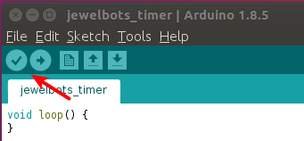

# Coding & Cupcakes Worksheet

## Overview
 Hello and welcome to Coding & Cupcakes: Jewelbots! Today you will code a Jewelbots programmable friendship bracelet to blink and buzz according to your instructions. You will use the C language to program a bluetooth enabled microcontroller.

## Prep Work

1. Open your Jewelbot and plug it in to the USB port on your computer to start charging it up.
2. Download the Arduino IDE from [https://www.arduino.cc/en/Main/Software](https://www.arduino.cc/en/Main/Software) onto a Windows, Apple, or Linux computer \(Chromebooks don't work with Jewelbots at this time.\).
    * If you're using Linux, here are some pointers if you're unsure how to download:
        1. The download will give you a `.tar` file. Move it from your Downloads folder into your home folder.
        2. Open Archive Manager. In Archive Manager, go to File -> Open and open the `.tar` file, then click **Extract** to unpack it. This should create an arduino folder.
        3. Open a terminal, go into the newly-created arduino folder, and type `./install.sh`.
        4. Once the process is finished, find and open the Arduino application using your computer's search feature.
3. In the Arduino IDE, go to File -> Preferences. Copy and paste the following code into **Additional Boards Manager URLS** and then click OK: `https://jewelbots.github.io/arduino-library/package_jewelbots_index.json,https://jewelbots.github.io/arduino-firmware/package_jewelbots_firmware_index.json,https://jewelbots.github.io/arduino-friendship/package_jewelbots_friendship_index.json`
4. In the Arduino IDE, select **Tools** -> **Board** -> **Boards Manager** and search for Jewelbots. Three libraries should appear. For each library, click anywhere in the box to reveal the install button and click **Install**. (See screenshot below.)


5. Restart the Arduino IDE.

## Getting to know your Jewelbot


Your Jewelbot has fun features that you can interact with:

* A button in the center (the "magic button")
* 4 LEDS that can light up in different colors, labeled by their positions: SW, NW, NE, SE
* A buzzer inside

Turning your Jewelbot on and off:

* Turn your Jewelbot on by pressing the magic button once. When the Jewelbot turns on, it buzzes and the LEDs light up.
* Turn your Jewelbot off by holding down the magic button for 5 seconds ("1 Mississippi, 2 Mississippi, ..."). When the Jewelbot turns off, all the LEDs light up.

Your Jewelbot can also use Bluetooth to detect when another Jewelbot is nearby if they're paired with each other. We'll try this out next.

## Pairing

1. Find another girl to pair with for this part.
2. Unplug both of your Jewelbots and make sure they're both turned on.
3. Press the magic button on one Jewelbot for 2 seconds to put it into pairing mode. It should slowly flash all white lights.
4. Press the magic button on the other Jewelbot for 2 seconds to put it into pairing mode also. The first Jewelbot should now stay all white while the second one cycles through different colors.
5. Choose a friendship color by pressing the magic button on the second Jewelbot when it's showing that color.

Now you'll know when your friend is nearby because your Jewelbots will light up with your friendship color!

## Programming your Jewelbot: The Basics

Your Jewelbot has two different coding modes: **Friendship Coding** and **Solo Coding**. You can use Friendship Coding to program your Jewelbot to do different things when your friend is nearby. With **Solo Coding**, you can program your Jewelbot to do things on its own. We'll start with Solo Coding to get some practice with coding the Jewelbot.

#### Writing the code

First we'll write the program on our computer:

2. Erase all the code in the Arduino IDE text window and replace it with the sample code below.

  ```
  void setup() {
    // put your setup code here, to run once:
  }

  void loop() {
    // put your main code here, to run repeatedly:
    LED led;
    Timer timer;
    led.turn_on_single(SW, GREEN);
    timer.pause(500);
    led.turn_off_single(SW);
    timer.pause(500);
  }
  ```
3. Choose **File** -> **Save As** and name your file **jewelbots_sample**. Save it to your computer's desktop.

4. Click on the checkmark button in the Arduino IDE; this will check the code for syntax errors - for example, a missing semicolon at the end of a line. If you get any errors, ask a mentor for help!

<p align="center">

</p>

#### Uploading the code

Right now, the code you wrote is only on your laptop. We need to upload it to the tiny computer inside your Jewelbots bracelet.

1. Plug your Jewelbot into your computer.
2. Select **Tools** -> **Board** -> **Solo Coding Mode**
3. Select **Tools** -> **Port** and make sure it's set to a USB port.
4. Press the magic button for 2 seconds to put your Jewelbot in to Upload Mode. When you release the button, all 4 LEDs will breathe blue.
5. Click the upload arrow button in the Arduino IDE to upload your code. You will get an orange success message when upload is complete.
    * If you're on a Linux computer and your code repeatedly won't upload, you may need to give your computer permission to use the USB ports by typing `sudo adduser $USER dialout` into the terminal.
6. The Jewelbot should buzz and light up when the uploading process is done.

#### Running the code

To see your code in action, unplug the Jewelbot. Your program will immediately start running. Can you see how the code in your program matches up with what the Jewelbot is doing?

## Programming your Jewelbot: Write your own code!

You've learned the basic steps of programming the Jewelbot:
* writing the code
* uploading the code
* running the code

Now try changing the program to make it do something different:
1. Using the [Jewelbots documentation](https://jewelbots.com/pages/support), modify the sample program so that the LED it turns on:
    * is a different color
    * is in a different position
    * stays on for a longer time
2. Once you think your program is correct, click the checkmark button to check the syntax.
3. Save your program as **jewelbots_yourname**
4. Follow the steps for uploading and running your code. Did it do what you expected?
5. Use the documentation for [LED Animations](https://jewelbots.com/pages/support) or the [Buzzer](https://jewelbots.com/pages/support) to modify the program again. Program the Jewelbot to do at least 3 different things inside the curly brackets of the **loop** function.
6. Save, upload, and run your new program. If it doesn't work, see if you can figure out why. Once you get it working, show it to us!

## Counting down to cupcake time  

Sometimes you just need to know how long it is until cupcake time! Our next program is a timer that you set by pressing the magic button on the Jewelbot. After you upload the timer program to the Jewelbot, you will be able to set the timer for a certain number of minutes by pressing the magic button that many times - for example, you can set the timer for 2 minutes by pressing the magic button 2 times.

1. Replace the existing code in the Arduino IDE with the code below:
  ```
  Animation animation;
  Buzzer buzz;
  LED led;
  Timer timer;
  int x = 0;

  void setup() {
  }

  void loop() {
  }

  void button_press(void){
    x = x+1;
  }

  void button_press_long(void) {
    int i = 0;
    int j = 0;
    for(int i = 1; i <= x; i++){
      led.flash_all(BLUE,1000);
      timer.pause(500);
    }

    for(int j = 1; j <= x*6; j++){
      timer.pause(10000);
      if (j % 6 == 0) {
        led.flash_all(RED, 1000);
      }
    }

    x = 0;
    buzz.short_buzz();
    animation.rainbows();
  }
  ```
2. Save the file as **jewelbots_timer**
3. Click the checkmark button to check the syntax, then upload the program to your Jewelbot.
4. Unplug your Jewelbot and test your new timer!
    * Click the magic button ONCE to set the timer for 1 minute.
    * Press the magic button for two full seconds (counting 1 Mississippi, 2 Mississippi) to start the timer. You will see all four leds flash blue once for every minute set on the timer.
    * The LEDs will flash red once every 60 seconds. When the timer ends, you will feel a buzz and see an LED animation.
5. Congratulations! You programmed an embedded system, that's something to be proud of.

## Understanding the timer program   

#### What's a variable?
Variables are like suitcases that store data for us. We declare our variables at the beginning of our Jewelbots program like this.
```
Animation animation;
Buzzer buzz;
LED led;
Timer timer;
int x = 0;
```
The first four variables: Animation, Buzzer, LED, and Timer hold data from the Jewelbots library. The final variable we named "x". We declared x as an integer by giving it the prefix "int". We set x to have the value of 0 by typing `x = 0`. In programming, the symbol = does not mean equals, it means "has the value of".

#### What's a function?
A function is a piece of code that is callable. A function can take inputs known as parameters. A function performs a task. A function can return something. We wrote a function named button_press(). It has the return type of void which we indicate by giving it the prefix void. This function also takes one parameter, void. We indicate this by putting the word void inside the function's parenthesis.
```
void button_press(void){
  x = x+1;
}
```
* Inside the curly braces of the button_press() function body, look at this line of code. `x = x+1;` Remembering that the = sign means "has the value of" in programming, read the line of code out loud. Can you guess what it is doing? Based on the name of this function, can you describe what is going to happen every time the button is pressed?

#### What's a for loop?
A "for loop" is a conditional that repeats some code according to the conditions you give it. For loops are super useful for writing code that you want to repeat more than once. A "for loop" starts with the word "for". The conditions are inside parentheses. The conditions go in this order (__start, stop, step__).

* Look inside the button_press_long() function at this for loop.
```
for(int i = 1; i <= x; i++){
    led.flash_all(BLUE,1000);
    timer.pause(500);
}
```
The conditions are `(int i = 1; i <= x; i++)`. This means: _start_ with an integer type variable called i that has the value of 1, _stop_ when i no longer has a value equal to or less than x, _step_ each time through the loop by adding 1 to i for every repeat. Don't understand it all yet? Not to worry, this is the sort of thing that's easiest to learn by doing. So let's get to something fun... colors!

#### Colors
The light emitting diodes (leds) on your Jewelbot can produce several different colors. Look through the code for the command `led.flash_all(BLUE,1000);` You can change `BLUE` to any of these: GREEN, BLUE, YELLOW, MAGENTA, CYAN, or WHITE. After you've changed the color, repeat the steps from the Uploading section and see how your Jewelbot displays the colors you told it to!

#### Time
In the button_press_long() function we have a for loop that tells our Jewelbot to flash all the leds red once per minute. A minute is 60,000 miliseconds but the pause method can't handle numbers that big so we split it up into pauses of 10000 microseconds that repeat 6 times. Experiment with changing the microseconds in your program to make the leds flash every second or every 10 seconds or what ever you want!
```
for(int j = 1; j <= x*6; j++){
    timer.pause(10000);
    if (j % 6 == 0) {
      led.flash_all(RED, 1000);
}
```
#### Animations
The most exciting part of the Jewelbots library is that it includes predefined sequences of led flashes called animations. We call `animation.rainbows();` one time in our program, when the timer is up. Can you find other places to call `animation.rainbows();` in your program?

## Friendship Coding your Jewelbot
Remember how Jewelbots have two modes? Friendship Coding uses two inputs (the magic button and Bluetooth) and three outputs (led lights, buzzer, and Bluetooth). To code a friendship program for your Jewelbot, create a new file in the Arduino IDE and set the Board (found under Tools) to Friendship Coding Mode. Then go to this repo and copy the code from one of the friendship program files [Coding & Cupcakes: Jewelbots](https://github.com/KansasCityWomeninTechnology/jewelbots).


## Homework
Did you love working with code? If you want to learn more on your own, we have suggestions for you.

* Come to one of our other [Coding & Cupcakes events](https://www.eventbrite.com/o/coding-amp-cupcakes-kansas-city-16053804463).
* Come to a [Coder Dojo event](http://coderdojokc.com/).
* Create an account on [Codecademy](http://www.codecademy.com/) and try out another microcontroller programming language like Python or Javascript [Programming](https://www.codecademy.com/catalog/subject/programming).
* Visit the Jewelbots community forums (they are well moderated to be safe for kids) and watch their videos on advanced programming for your Jewelbot [Jewelbots Community Forums](http://alpha.jewelbots.com/).
* Also, [Jewelbots Learning Resources](https://jewelbots.com/pages/support)
* Visit Tinkercad Learn and click on "Circuits" [Tinkercad Learn](https://www.tinkercad.com/learn/).
* Check out the Arduino project hub for ideas about what you can make with your new skills! [Arduino Project Hub](https://create.arduino.cc/projecthub).
