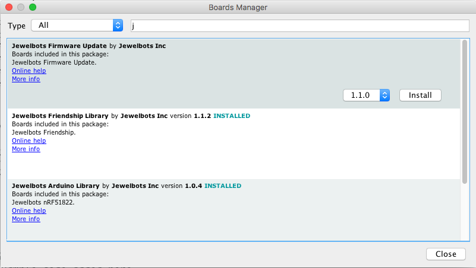

# Coding & Cupcakes Worksheet
## Overview
Hello and welcome to Coding & Cupcakes: Jewelbots! Today you will code a Jewelbots programmable friendship bracelet to blink and buzz according to your instructions. You will use the C language to program a bluetooth enabled microcontroller.

## Prep Work

1. Open your Jewelbot and plug it in to the USB port on your computer to start charging it up.
2. Download the Arduino IDE from [https://www.arduino.cc/en/Main/Software](https://www.arduino.cc/en/Main/Software) onto a Windows, Apple, or Linux computer \(Chromebooks don't work with Jewelbots at this time.\).
    1.  Linux:
        1. The download will give you a `.tar` file. Move it from your Downloads folder into your home folder.
        2. Open Archive Manager. In Archive Manager, go to File -> Open and open the `.tar` file, then click **Extract** to unpack it. This should create an arduino folder.
        3. Open a terminal, go into the newly-created arduino folder, and type `./install.sh`.
        4. Once the process is finished, find and open the Arduino application using your computer's search feature.
3. In the Arduino IDE, go to File -> Preferences. Copy and paste the following code into **Additional Boards Manager URLS** and then click OK: `https://jewelbots.github.io/arduino-library/package_jewelbots_index.json,https://jewelbots.github.io/arduino-firmware/package_jewelbots_firmware_index.json,https://jewelbots.github.io/arduino-friendship/package_jewelbots_friendship_index.json`

4. In the Arduino IDE, select **Tools** -> **Board** -> **Boards Manager** and search for Jewelbots. Three libraries should appear. For each library, click anywhere in the box to reveal the install button and click **Install**. (See screenshot below.)


## Solo coding your Jewelbot
There are two types of programs for Jewelbots, solo coding and friendship coding. Solo Coding uses one input (the magic button) and two outputs (led lights and buzzer).

The first program we are going to write is a Timer that you set by pressing the magic button on the Jewelbot. After we code, compile and upload our Timer program to the Jewelbot, you will be able to press the magic button X number of times to set the timer for X number of minutes.

6. Make sure you are starting with a blank file in your Arduino IDE, then Copy and paste the following code into the text window.


```
Animation animation;
Buzzer buzz;
LED led;
Timer timer;
int x = 0;

void setup() {
}

void loop() {
}

void button_press(void){
  x = x+1;
}

void button_press_long(void) {
  int i = 0;
  int j = 0;
  for(int i = 1; i <= x; i++){
    led.flash_all(BLUE,1000);
    timer.pause(500);
  }

  for(int j = 1; j <= x*6; j++){
    timer.pause(10000);
    if (j % 6 == 0) {
      led.flash_all(RED, 1000);
    }
  }

  x = 0;
  buzz.short_buzz();
  animation.rainbows();
}
```
7. Choose File > Save As and name your file jewelbots_timer. Save it to your computer's desktop.

8. Plug in your Jewelbot and select TOOLS > BOARDS > SOLO CODING MODE in the Arduino IDE. Make sure USB is selected as the Port under the Tools menu.

## Uploading
9. Click on the checkmark button in the Arduino IDE, this will verify that the code compiles correctly. If you get any errors, ask a mentor for help!

10. Put your Jewelbot into upload mode by plugging it in to the computer and holding down on the magic button for three seconds. You will see all four leds breathe blue.

11. Click the the arrow button in the Arduino IDE to upload your code. You will get an orange success message when upload is complete. If you're on a Linux computer and your code repeatedly won't upload, you may need to give your computer permission to use the USB ports by typing `sudo adduser $USER dialout` into the terminal.

12. Unplug your Jewelbot and test your new Timer! Click the magic button ONCE to set the timer for 1 minute. Press the magic button for two full seconds (counting 1 Mississippi, 2 Mississippi) to start the timer. You will see all four leds flash blue one time for every minute set on the timer. The leds will flash red once every 60 seconds. When the timer ends, you will feel a buzz and see an led animation.

13. Congratulations! You programmed an embedded system, that's something to be proud of.

### What's a variable?
Variables are like suitcases that store data for us. We declare our variables at the beginning of our Jewelbots program like this.
```
Animation animation;
Buzzer buzz;
LED led;
Timer timer;
int x = 0;
```
The first four variables: Animation, Buzzer, LED, and Timer hold data from the Jewelbots library. The final variable we named "x". We declared x as an integer by giving it the prefix "int". We set x to have the value of 0 by typing `x = 0`. In programming, the symbol = does not mean equals, it means "has the value of".

### What's a function?
A function is a piece of code that is callable. A function can take inputs known as parameters. A function performs a task. A function can return something. We wrote a function named button_press(). It has the return type of void which we indicate by giving it the prefix void. This function also takes one parameter, void. We indicate this by putting the word void inside the function's parenthesis.
```
void button_press(void){
  x = x+1;
}
```
* Inside the curly braces of the button_press() function body, look at this line of code. `x = x+1;` Remembering that the = sign means "has the value of" in programming, read the line of code out loud. Can you guess what it is doing? Based on the name of this function, can you describe what is going to happen every time the button is pressed?

### What's a for loop?
A "for loop" is a conditional that repeats some code according to the conditions you give it. For loops are super useful for writing code that you want to repeat more than once. A "for loop" starts with the word "for". The conditions are inside parentheses. The conditions go in this order (__start, stop, step__).

* Look inside the button_press_long() function at this for loop.
```
for(int i = 1; i <= x; i++){
    led.flash_all(BLUE,1000);
    timer.pause(500);
}
```
The conditions are `(int i = 1; i <= x; i++)`. This means: _start_ with an integer type variable called i that has the value of 1, _stop_ when i no longer has a value equal to or less than x, _step_ each time through the loop by adding 1 to i for every repeat. Don't understand it all yet? Not to worry, this is the sort of thing that's easiest to learn by doing. So let's get to something fun... colors!

### Colors
The light emitting diodes (leds) on your Jewelbot can produce several different colors. Look through the code for the command `led.flash_all(BLUE,1000);` You can change `BLUE` to any of these: GREEN, BLUE, YELLOW, MAGENTA, CYAN, or WHITE. After you've changed the color, repeat the steps from the Uploading section and see how your Jewelbot displays the colors you told it to!


### Time
In the button_press_long() function we have a for loop that tells our Jewelbot to flash all the leds red once per minute. A minute is 60,000 miliseconds but the pause method can't handle numbers that big so we split it up into pauses of 10000 microseconds that repeat 6 times. Experiment with changing the microseconds in your program to make the leds flash every second or every 10 seconds or what ever you want!
```
for(int j = 1; j <= x*6; j++){
    timer.pause(10000);
    if (j % 6 == 0) {
      led.flash_all(RED, 1000);
}
```
### Animations
The most exciting part of the Jewelbots library is that it includes predefined sequences of led flashes called animations. We call `animation.rainbows();` one time in our program, when the timer is up. Can you find other places to call `animation.rainbows();` in your program?

## Friendship Coding your Jewelbot
Remember how Jewelbots have two modes? Friendship Coding uses two inputs (the magic button and Bluetooth) and three outputs (led lights, buzzer, and Bluetooth). To code a friendship program for your Jewelbot, create a new file in the Arduino IDE and set the Board (found under Tools) to Friendship Coding Mode. Then go to this repo and copy the code from one of the friendship program files [Coding & Cupcakes: Jewelbots](https://github.com/KansasCityWomeninTechnology/jewelbots).

### How to pair
Make sure both Jewelbots are unplugged, turned on, and within 60 centimeters of each other. Hold down the button on both Jewelbots for 2 full seconds \(counting 1 Mississippi, 2 Mississippi.\) One Jewelbot will light up all white, the other will cycle through colors one at a time. You pick the friendship group color by pressing the button on the cycling Jewelbot.

## Homework
Did you love working with code? If you want to learn more on your own, we have suggestions for you.

* Come to one of our other [Coding & Cupcakes events](https://www.eventbrite.com/o/coding-amp-cupcakes-kansas-city-16053804463).
* Come to a [Coder Dojo event](http://coderdojokc.com/).
* Create an account on [Codecademy](http://www.codecademy.com/) and try out another microcontroller programming language like Python or Javascript [Programming](https://www.codecademy.com/catalog/subject/programming).
* Visit the Jewelbots community forums (they are well moderated to be safe for kids) and watch their videos on advanced programming for your Jewelbot [Jewelbots Community Forums](http://alpha.jewelbots.com/).
* Visit Tinkercad Learn and click on "Circuits" [Tinkercad Learn](https://www.tinkercad.com/learn/).
* Check out the Arduino project hub for ideas about what you can make with your new skills! [Arduino Project Hub](https://create.arduino.cc/projecthub).
